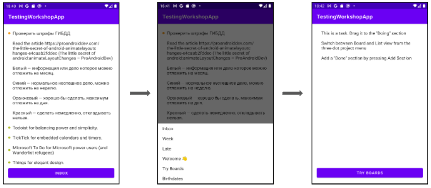

# Практические задания к лекции "Введение в тестирование"

Простое приложение построенное на API https://todoist.com/.  



Задания для самостоятельного выполнения находятся в диектории `/workshop`

По умолчанию, приложение использует общий демо аккаунт. Для переключения аккаунта, замените значение константы `API_KEY`. 
```kotlin
class ApiKeyInterceptor: Interceptor {
    companion object {
        private const val API_KEY = "<ваш токен>"
    }
    ...
}
```
