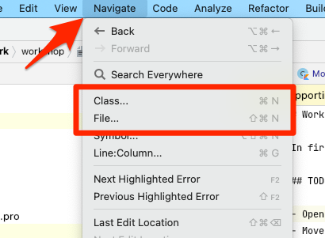
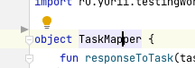
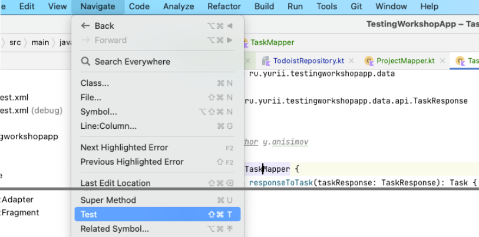
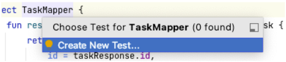
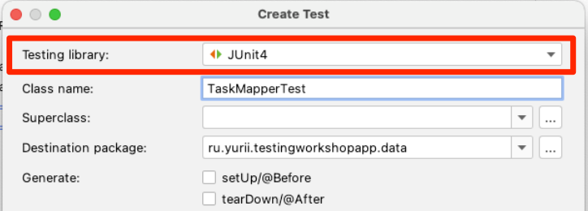
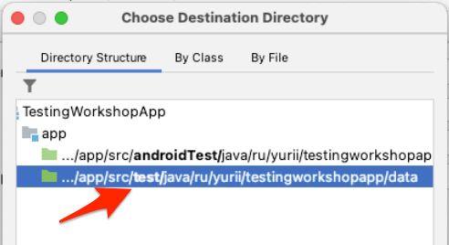

# Workshop 1

В рамках воркшопа вы создадите пару тестов для `TaskMapper`

## Добавить тест класс

- Найти класс `TaskMapper`

    Вы можете воспользоваться возможностями меню **Navigate**

    

- Установить курсор на название класса

    
  
- В меню **Navigate** выбрать пункт **Test** (или нажать на желтую ламочку рядом с названием класса)

    

- Выбрать **Create new test**

    

- Выбрать в появившемся окне библиотеку `JUnit4`

    

- Выбрать директорию `/test/` (директория для модульных тестов)

    

- Добавить пустое тело класса `TaskMapperTest`
    ```kotlin
    class TaskMapperTest {
    
    }
    ```

# Summary

В результате у вас должно получиться что-то похожее на:

```kotlin
package ru.yurii.testingworkshopapp.data

import org.junit.Assert.assertEquals
import org.junit.Test
import ru.yurii.testingworkshopapp.R
import ru.yurii.testingworkshopapp.data.api.TaskResponse

class TaskMapperTest {

    @Test
    fun `responseToTask by default returns Task item`() {
        val taskResponse = createTaskResponse(
            id = 1L, projectId = 2L, content = "Test item", order = 5, priority = 2
        )

        val task = TaskMapper.responseToTask(taskResponse)

        assertEquals(1L, task.id)
        assertEquals(2L, task.projectId)
        assertEquals("Test item", task.title)
        assertEquals(5, task.order)
        assertEquals(2, task.priority)
    }

    @Test
    fun `responseToTask for priority 4 returns color orange`() {
        val taskResponse = createTaskResponse(priority = 4)

        val task = TaskMapper.responseToTask(taskResponse)

        assertEquals(R.color.orange, task.colorRes)
    }

    fun createTaskResponse(
        id: Long = 0L,
        projectId: Long = 0L,
        content: String = "",
        order: Int = 0,
        priority: Int = 0
    ): TaskResponse {
        return TaskResponse(
            id = id,
            projectId = projectId,
            content = content,
            order = order,
            priority = priority
        )
    }
}
```
