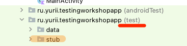

# Workshop 2

В рамках воркшопа вы напишите пару тестов для асинхронного кода на примере `Kotlin coroutines` и `ViewModel` + `StateFlow`.

## Подготовить stub'ы

- Создать пакет `stub` в директории `test`

  

- Добавить класс `GetAllProjectsUseCaseStub` в созданный пакет `stub` 

    Унаследовать от `GetAllProjectsUseCase`, добавить реализацию для тестов.

    ```kotlin
    class GetAllProjectsUseCaseStub : GetAllProjectsUseCase {
        var resultProvider: () -> List<Project> = { emptyList() }

        override suspend fun invoke(): List<Project> = resultProvider()
    }
    ```

- Добавить еще один класс `TasksForProjectUseCaseStub` рядом с предыдущим

    Унаследовать от `TasksForProjectUseCase`, добавить реализацию для тестов.

    ```kotlin
    class TasksForProjectUseCaseStub : TasksForProjectUseCase {
        var resultProvider: () -> List<Task> = { emptyList() }

        override suspend fun invoke(projectId: Long): List<Task> = resultProvider()
    }
    ```

## Добавить тест класс

- Найти класс `TaskListViewModelImpl` и создать для него тест класс.

  Аналогично тому, как вы добавили тест класс в предыдущем воркшопе.

- Добавить пустое тело класса `TaskListViewModelImplTest`
    ```kotlin
    class TaskListViewModelImplTest {
    
    }
    ```

## Тест "метод `load` по умолчанию возвращает первый проект"  

- Добавить правила, чтобы преобразовать асинхронное выполнение в последовательное на текущем потоке.
    ```kotlin
    class TaskListViewModelImplTest {
        @get:Rule
        val viewModelRule = InstantTaskExecutorRule()
        @get:Rule
        val mainDispatcherRule = MainDispatcherRule()
          
    }
    ```

- Создать фабричный метод `createViewModel(...)` в классе `TaskListViewModelImplTest`
    ```kotlin
    private fun createViewModel(
        getAllProjectsUseCase: GetAllProjectsUseCase = GetAllProjectsUseCaseStub(),
        tasksForProjectUseCase: TasksForProjectUseCase = TasksForProjectUseCaseStub()
    ): TaskListViewModel {
        return TaskListViewModelImpl(getAllProjectsUseCase, tasksForProjectUseCase)
    }
    ```

- Создать фабричный метод `createProject(...)` в классе `TaskListViewModelImplTest`
    ```kotlin
    private fun createProject(
        id: Long = 1L,
        title: String = "",
        order: Int = 0,
    ): Project = Project(
        id = id,
        title = title,
        order = order
    )
    ```

- Добавить пустой метод в класс `TaskListViewModelImplTest`

    Оберните тело метода в `runTest`, чтобы протестировать `suspend` функции.

    ```kotlin
    @Test
    fun `load by default returns first project`() = runTest {

    }
    ```

- Создать инстанс `GetAllProjectsUseCaseStub` внутри добавленного метода и подготовить возвращаемые данные
    ```kotlin
    @Test
    fun `load by default returns first project`() = runTest {
        val getAllProjectsUseCase = GetAllProjectsUseCaseStub().apply {
            resultProvider = { listOf(createProject(title = "First"), createProject(title = "Second")) }
        }
   }
    ```

- Создать экземпляр `TaskListViewModel` с помощью фабричного метода `createViewModel`
    ```kotlin
    @Test
    fun `load by default returns first project`() = runTest {
        val getAllProjectsUseCase = GetAllProjectsUseCaseStub().apply { ... }
        val viewModel = createViewModel(getAllProjectsUseCase = getAllProjectsUseCase)
    }
    ```

- Добавить вызов `viewModel.load()`
    ```kotlin
    @Test
    fun `load by default returns first project`() = runTest {
        ...
        val viewModel = ...

        viewModel.load()
    }
    ```

- Проверить содержимое `StateFlow`
    ```kotlin
    @Test
    fun `load by default returns first project`() = runTest {
        ...
        viewModel.load()

        val state = viewModel.projectName.value as ProjectState.Loaded
        assertEquals("First", state.project.title)
    }
    ```

- Запустить тест

## Тест "метод `loadTasksForProject` по умолчанию возвращает список задач"

- Создать фабричный метод `createTask(...)` в классе `TaskListViewModelImplTest`
    ```kotlin
    private fun createTask(
        id: Long = 0L,
        projectId: Long = 0L,
        title: String = "",
        order: Int = 0,
        priority: Int = 0,
        colorRes: Int = 0
    ): Task = Task(
        id = id,
        projectId = projectId,
        title = title,
        order = order,
        priority = priority,
        colorRes = colorRes
    )
    ```

- Добавить еще один пустой метод

    Оберните тело метода в `runTest`, чтобы протестировать `suspend` функции.

    ```kotlin
    @Test
    fun `loadTasksForProject by default returns task list`() = runTest {

    }
    ```

- Создать список задач внутри добавленного метода
    ```kotlin
    @Test
    fun `loadTasksForProject by default returns task list`() = runTest {
        val tasks = listOf(
            createTask(title = "First"),
            createTask(title = "Second"),
            createTask(title = "Third")
        )
    }
    ```

- Создать инстанс `TasksForProjectUseCaseStub` и подготовить возвращаемые данные
    ```kotlin
    @Test
    fun `loadTasksForProject by default returns task list`() = runTest {
        val tasks = ...
        val useCase = TasksForProjectUseCaseStub().apply {
            resultProvider = { tasks }
        }
    }
    ```

- Создать экземпляр `TaskListViewModel` с помощью фабричного метода `createViewModel`
    ```kotlin
    @Test
    fun `loadTasksForProject by default returns task list`() = runTest {
        ...
        val useCase = TasksForProjectUseCaseStub().apply { ... }
        val viewModel = createViewModel(tasksForProjectUseCase = useCase)
    }
    ```

- Добавить вызов `viewModel.loadTasksForProject(...)`
    ```kotlin
    @Test
    fun `loadTasksForProject by default returns task list`() = runTest {
        ...
        val viewModel = ...

        viewModel.loadTasksForProject(createProject(id = 10L))
    }
    ```

- Проверить содержимое `StateFlow`
    ```kotlin
    @Test
    fun `loadTasksForProject by default returns task list`() = runTest {
        ...
        viewModel.loadTasksForProject(...)

        val state = viewModel.tasksStateOutput.value as TaskListState.Loaded
        assertEquals(tasks, state.tasks)
    }
    ```

- Запустить тесты для класса `TaskListViewModelImplTest`

# Summary

В результате у вас должно получиться что-то похожее на:

```kotlin
package ru.yurii.testingworkshopapp.tasklist.viewmodel

import androidx.arch.core.executor.testing.InstantTaskExecutorRule
import kotlinx.coroutines.ExperimentalCoroutinesApi
import kotlinx.coroutines.test.runTest
import org.junit.Assert.assertEquals
import org.junit.Rule
import org.junit.Test
import ru.yurii.testingworkshopapp.data.Project
import ru.yurii.testingworkshopapp.data.Task
import ru.yurii.testingworkshopapp.data.usecase.GetAllProjectsUseCase
import ru.yurii.testingworkshopapp.data.usecase.TasksForProjectUseCase
import ru.yurii.testingworkshopapp.stub.GetAllProjectsUseCaseStub
import ru.yurii.testingworkshopapp.stub.TasksForProjectUseCaseStub
import ru.yurii.testingworkshopapp.util.MainDispatcherRule

@OptIn(ExperimentalCoroutinesApi::class)
class TaskListViewModelImplTest {

    @get:Rule
    val viewModelRule = InstantTaskExecutorRule()
    @get:Rule
    val mainDispatcherRule = MainDispatcherRule()

    @Test
    fun `load by default returns first project`() = runTest {
        val getAllProjectsUseCase = GetAllProjectsUseCaseStub().apply {
            resultProvider = { listOf(createProject(title = "First"), createProject(title = "Second")) }
        }
        val viewModel = createViewModel(getAllProjectsUseCase = getAllProjectsUseCase)

        viewModel.load()

        val state = viewModel.projectName.value as ProjectState.Loaded
        assertEquals("First", state.project.title)
    }

    @Test
    fun `loadTasksForProject by default returns task list`() = runTest {
        val tasks = listOf(
            createTask(title = "First"),
            createTask(title = "Second"),
            createTask(title = "Third")
        )
        val useCase = TasksForProjectUseCaseStub().apply {
            resultProvider = { tasks }
        }
        val viewModel = createViewModel(tasksForProjectUseCase = useCase)

        viewModel.loadTasksForProject(createProject(id = 10L))

        val state = viewModel.tasksStateOutput.value as TaskListState.Loaded
        assertEquals(tasks, state.tasks)
    }

    private fun createViewModel(
        getAllProjectsUseCase: GetAllProjectsUseCase = GetAllProjectsUseCaseStub(),
        tasksForProjectUseCase: TasksForProjectUseCase = TasksForProjectUseCaseStub()
    ): TaskListViewModel {
        return TaskListViewModelImpl(getAllProjectsUseCase, tasksForProjectUseCase)
    }

    private fun createProject(
        id: Long = 1L,
        title: String = "",
        order: Int = 0,
    ): Project = Project(
        id = id,
        title = title,
        order = order
    )

    private fun createTask(
        id: Long = 0L,
        projectId: Long = 0L,
        title: String = "",
        order: Int = 0,
        priority: Int = 0,
        colorRes: Int = 0
    ): Task = Task(
        id = id,
        projectId = projectId,
        title = title,
        order = order,
        priority = priority,
        colorRes = colorRes
    )
}
```
