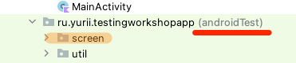
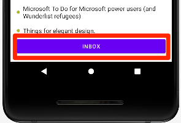
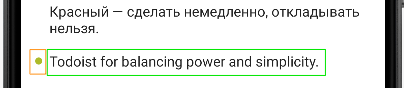
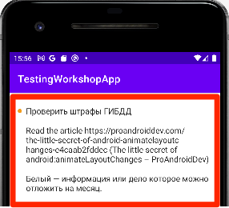
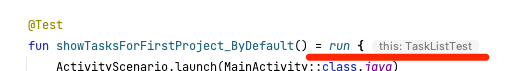
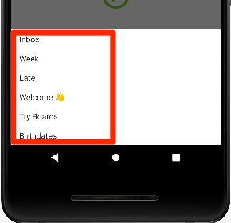

# Workshop 3

В рамках воркшопа вы напишите пару UI тестов с использованием библиотеки Kaspresso.

## Добавить тест класс

Классы UI тестов не привязаны к определенному классу в коде. Обычно их создают также как и классы продуктового кода. 

- Создать класс `TaskListTest` в директории `androidTest`

    


- Унаследовать от класса `TestCase`

    Обратите внимание на package: `com.kaspersky.kaspresso.testcases.api.testcase.TestCase`
    ```kotlin
    class TaskListTest : TestCase() {
    
    }
    ```

## Тест "по умолчанию отображается список задач для первого проекта"

### Подготовить Screen (Page Object) для первого теста 

- Создать пакет `screen` в директории `androidTest`

    

- Добавить класс `TaskListScreen` в созданный пакет `screen`

    - Создать Singleton (использовать ключевое слово `object`)
    - Унаследовать от `KScreen` и типизировать `TaskListScreen`
    ```kotlin
    object TaskListScreen : KScreen<TaskListScreen>() {
    }
    ```

- Переопределить ссылку на разметку и класс
    ```kotlin
    object TaskListScreen : KScreen<TaskListScreen>() {
        override val layoutId: Int = R.layout.task_list_fragment
        override val viewClass: Class<*> = TaskListFragment::class.java
    }
    ```

- Добавить элемент: "Кнопка с названием текущего проекта"

    

    ```kotlin
    object TaskListScreen : KScreen<TaskListScreen>() {
        ...
        override val viewClass: Class<*> = ...
    
        val projectButton = KButton { withId(R.id.currentProject) }
    }
    ```

- Описать элемент списка задач

      

    ```kotlin
    object TaskListScreen : KScreen<TaskListScreen>() {
        ...
        class TaskItem(parent: Matcher<View>) : KRecyclerItem<TaskItem>(parent) {
            val title = KTextView(parent) { withId(R.id.title) }
            val bullet = KImageView(parent) { withId(R.id.bullet) }
        }
    }
    ```

- Добавить элемент: "Список задач"

    

    ```kotlin
    object TaskListScreen : KScreen<TaskListScreen>() {
        ...
        val projectButton = ...
        val taskList = KRecyclerView({ withId(R.id.taskList) }, { itemType { TaskItem(it) } })
    
        class TaskItem(...) { ... }
    }
    ```

### Добавить тест

- Добавить пустой метод в класс `TaskListTest`

    Перенаправить вызов методу `run(...)` класса `BaseTestCase` из библиотеки Kaspresso.      
    ```kotlin
    @Test
    fun showTasksForFirstProject_ByDefault() = run {

    }
    ```

    **Если вы забудете унаследовать класс от `TestCase`, будет использован метод Kotlin** 

    

- Добавить запуск `MainActivity`
    ```kotlin
    @Test
    fun showTasksForFirstProject_ByDefault() = run {
        ActivityScenario.launch(MainActivity::class.java)
    }
    ```

- Добавить проверку отображения названия проекта на кнопке
    ```kotlin
    @Test
    fun showTasksForFirstProject_ByDefault() = run {
        ActivityScenario.launch(...)

        step("Отображается название проекта") {
            TaskListScreen.projectButton.hasText("Inbox")
        }
    }
    ```

- Добавить проверку количества элементов в списке
    ```kotlin
    @Test
    fun showTasksForFirstProject_ByDefault() = run {
        ...
        step("Отображается название проекта") { ... }
        step("Отображается список задач") {
            TaskListScreen.taskList.hasSize(12)
        }
    }
    ```

- Добавить проверку атрибутов одного из элементов списка

    - Выбрать элемент
    ```kotlin
    @Test
    fun showTasksForFirstProject_ByDefault() = run {
        ...
        step("Отображается список задач") {
            TaskListScreen.taskList.hasSize(...)
            TaskListScreen.taskList.childAt<TaskListScreen.TaskItem>(7) {
            }
        }
    }
    ```

    - Проверить текст
    ```kotlin
    @Test
    fun showTasksForFirstProject_ByDefault() = run {
        ...
            TaskListScreen.taskList.childAt<TaskListScreen.TaskItem>(7) {
                title.hasText("TickTick for embedded calendars and timers.")
            }
        ...
    }
    ```

    - Проверить маркер
    ```kotlin
    @Test
    fun showTasksForFirstProject_ByDefault() = run {
        ...
            TaskListScreen.taskList.childAt<TaskListScreen.TaskItem>(7) {
                title.hasText(...)
                bullet {
                    isDisplayed()
                    hasDrawableWithTint(R.drawable.marker, R.color.olive_green)
                }
            }
        ...
    }
    ```

- Запустить тест. 

     

## Тест "Изменяется список задач после выбора проекта"

### Подготовить Screen (Page Object) для второго теста

- Добавить класс `ChooseProjectScreen` в созданный пакет `screen`

  - Создать Singleton (использовать ключевое слово `object`)
  - Унаследовать от `KScreen` и типизировать `ChooseProjectScreen`
    ```kotlin
    object ChooseProjectScreen : KScreen<ChooseProjectScreen>() {
    }
    ```

- Переопределить ссылку на разметку и класс
    ```kotlin
    object ChooseProjectScreen : KScreen<ChooseProjectScreen>() {
        override val layoutId: Int = R.layout.choose_project_dialog_fragment
        override val viewClass: Class<*> = ChooseProjectDialogFragment::class.java
    }
    ```

- Описать элемент списка
    ```kotlin
    object ChooseProjectScreen : KScreen<ChooseProjectScreen>() {
        ...
        class ProjectItem(parent: Matcher<View>) : KRecyclerItem<ProjectItem>(parent) {
            val title = KTextView { withId(R.id.title) }
        }
    }
    ```

- Добавить элемент: "Список проектов"

  

    ```kotlin
    object ChooseProjectScreen : KScreen<ChooseProjectScreen>() {
        ...
        override val viewClass: Class<*> = ...
    
        val list = KRecyclerView({ withId(R.id.list) }, { itemType { ProjectItem(it) } })
    
        class ProjectItem(...)  { ... }
    }
    ```

### Добавить тест  

- Добавить пустой метод в класс `TaskListTest`

  Перенаправить вызов методу `run(...)` класса `BaseTestCase` из библиотеки Kaspresso.
    ```kotlin
    @Test
    fun tasksAreReplaced_AfterProjectIsChosen() = run {

    }
    ```

- Добавить запуск `MainActivity`
    ```kotlin
    @Test
    fun tasksAreReplaced_AfterProjectIsChosen() = run {
        ActivityScenario.launch(MainActivity::class.java)
    }
    ```

- Добавить шаг выбора проекта

    - Кликнуть по кнопке "Проект"
    ```kotlin
    @Test
    fun tasksAreReplaced_AfterProjectIsChosen() = run {
        ActivityScenario.launch(...)

        step("Выбор проекта") {
            TaskListScreen.projectButton.click()
        }
    }
    ```

    - Кликнуть на элементе в открывшемся списке проектов
    ```kotlin
    @Test
    fun tasksAreReplaced_AfterProjectIsChosen() = run {
        step("Выбор проекта") {
            TaskListScreen ...
            ChooseProjectScreen.list.childAt<ChooseProjectScreen.ProjectItem>(4) { click() }
        }
    }
    ```

- Добавить шаг проверки новых элементов в списке задач

    - Проверить текст на кнопке "Проект"
    ```kotlin
    @Test
    fun tasksAreReplaced_AfterProjectIsChosen() = run {
        step("Выбор проекта") { ... }
        step("Отображаются задачи выбранного проекта") {
            TaskListScreen.projectButton.hasText("Try Boards")
        }
    }
    ```

    - Проверить количество элементов в списке
    ```kotlin
    @Test
    fun tasksAreReplaced_AfterProjectIsChosen() = run {
        step("Отображаются задачи выбранного проекта") {
            TaskListScreen.projectButton ...
            TaskListScreen.taskList.hasSize(3)
        }
    }
    ```

- Запустить тесты для класса `TaskListTest`

# Summary

В результате у вас должно получиться что-то похожее на:

```kotlin
package ru.yurii.testingworkshopapp

import androidx.test.core.app.ActivityScenario
import com.kaspersky.kaspresso.testcases.api.testcase.TestCase
import org.junit.Test
import ru.yurii.testingworkshopapp.screen.ChooseProjectScreen
import ru.yurii.testingworkshopapp.screen.TaskListScreen

class TaskListTest : TestCase() {

    @Test
    fun showTasksForFirstProject_ByDefault() = run {
        ActivityScenario.launch(MainActivity::class.java)

        step("Отображается название проекта") {
            TaskListScreen.projectButton.hasText("Inbox")
        }
        step("Отображается список задач") {
            TaskListScreen.taskList.hasSize(12)
            TaskListScreen.taskList.childAt<TaskListScreen.TaskItem>(7) {
                title.hasText("TickTick for embedded calendars and timers.")
                bullet {
                    isDisplayed()
                    hasDrawableWithTint(R.drawable.marker, R.color.olive_green)
                }
            }
        }
    }

    @Test
    fun tasksAreReplaced_AfterProjectIsChosen() = run {
        ActivityScenario.launch(MainActivity::class.java)

        step("Выбор проекта") {
            TaskListScreen.projectButton.click()
            ChooseProjectScreen.list.childAt<ChooseProjectScreen.ProjectItem>(4) { click() }
        }
        step("Отображаются задачи выбранного проекта") {
            TaskListScreen.projectButton.hasText("Try Boards")
            TaskListScreen.taskList.hasSize(3)
        }
    }
}
```
