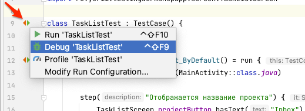

# Workshop 3

В рамках воркшопа вы напишите пару UI тестов с использованием библиотеки Kaspresso.

## Добавить тест класс

Классы UI тестов не привязаны к определенному классу в коде. Обычно их создают также как и классы продуктового кода. 

- Создать класс `TaskListTest` в директории `androidTest`

    


- Унаследовать от класса `TestCase`

    Обратите внимание на package: `com.kaspersky.kaspresso.testcases.api.testcase.TestCase`
    ```kotlin
    class TaskListTest : TestCase() {
    
    }
    ```

## Тест "по умолчанию отображается список задач для первого проекта"

### Подготовить Screen (Page Object) для первого теста 

- Создать пакет `screen` в директории `androidTest`

    

- Добавить класс `TaskListScreen` в созданный пакет `screen`

    - Создать Class (использовать ключевое слово `class`)
    - Унаследовать от `KScreen` и типизировать `TaskListScreen`
  
    ```kotlin
    class TaskListScreen : KScreen<TaskListScreen>() {
    }
    ```

- Переопределить ссылку на разметку и класс
    ```kotlin
    class TaskListScreen : KScreen<TaskListScreen>() {
        override val layoutId: Int = R.layout.task_list_fragment
        override val viewClass: Class<*> = TaskListFragment::class.java
    }
    ```

- Добавить элемент: "Кнопка с названием текущего проекта"

    

    ```kotlin
    class TaskListScreen : KScreen<TaskListScreen>() {
        ...
        override val viewClass: Class<*> = ...
    
        val projectButton = KButton { withId(R.id.currentProject) }
    }
    ```

- Описать элемент списка задач

      

    ```kotlin
    class TaskListScreen : KScreen<TaskListScreen>() {
        ...
        class TaskItem(parent: Matcher<View>) : KRecyclerItem<TaskItem>(parent) {
            val title = KTextView(parent) { withId(R.id.title) }
            val bullet = KImageView(parent) { withId(R.id.bullet) }
        }
    }
    ```

- Добавить элемент: "Список задач"

    

    ```kotlin
    class TaskListScreen : KScreen<TaskListScreen>() {
        ...
        val projectButton = ...
        val taskList = KRecyclerView({ withId(R.id.taskList) }, { itemType { TaskItem(it) } })
    
        class TaskItem(...) { ... }
    }
    ```

### Добавить тест

- Добавить пустой метод в класс `TaskListTest`

    Перенаправить вызов методу `run(...)` класса `BaseTestCase` из библиотеки Kaspresso.      
    ```kotlin
    @Test
    fun showTasksForFirstProject_ByDefault() = run {

    }
    ```

    > **ВАЖНО! Если вы забудете унаследовать тест класс от `TestCase`, будет использован `run` метод Kotlin. Будут подсвечены методы `step(...)`.** 

    > Так выглядит подсветка синтаксиса при использовании `run` метода Kotlin.

    > 

- Добавить запуск `MainActivity`
    ```kotlin
    @Test
    fun showTasksForFirstProject_ByDefault() = run {
        ActivityScenario.launch(MainActivity::class.java)
    }
    ```

- Добавить проверку отображения названия проекта на кнопке
    ```kotlin
    @Test
    fun showTasksForFirstProject_ByDefault() = run {
        ActivityScenario.launch(...)
        val taskListScreen = TaskListScreen()

        step("Отображается название проекта") {
            taskListScreen.projectButton.hasText("Inbox")
        }
    }
    ```

- Добавить проверку количества элементов в списке
    ```kotlin
    @Test
    fun showTasksForFirstProject_ByDefault() = run {
        ...
        step("Отображается название проекта") { ... }
        step("Отображается список задач") {
            taskListScreen.taskList.hasSize(12)
        }
    }
    ```

- Добавить проверку атрибутов одного из элементов списка

    - Выбрать элемент
        ```kotlin
        @Test
        fun showTasksForFirstProject_ByDefault() = run {
            ...
            step("Отображается список задач") {
                taskListScreen.taskList.hasSize(...)
                taskListScreen.taskList.childAt<TaskListScreen.TaskItem>(7) {
                }
            }
        }
        ```

    - Проверить текст
        ```kotlin
        @Test
        fun showTasksForFirstProject_ByDefault() = run {
            ...
                taskListScreen.taskList.childAt<TaskListScreen.TaskItem>(7) {
                    title.hasText("TickTick for embedded calendars and timers.")
                }
            ...
        }
        ```

    - Проверить маркер
        ```kotlin
        @Test
        fun showTasksForFirstProject_ByDefault() = run {
            ...
                taskListScreen.taskList.childAt<TaskListScreen.TaskItem>(7) {
                    title.hasText(...)
                    bullet {
                        isDisplayed()
                        hasDrawableWithTint(R.drawable.marker, R.color.olive_green)
                    }
                }
            ...
        }
        ```

- Запустить тест. 

     

## Тест "Изменяется список задач после выбора проекта"

### Подготовить Screen (Page Object) для второго теста

- Добавить класс `ChooseProjectScreen` в созданный пакет `screen`

  - Создать Class (использовать ключевое слово `class`)
  - Унаследовать от `KScreen` и типизировать `ChooseProjectScreen`
    
    ```kotlin
    class ChooseProjectScreen : KScreen<ChooseProjectScreen>() {
    }
    ```

- Переопределить ссылку на разметку и класс
    ```kotlin
    class ChooseProjectScreen : KScreen<ChooseProjectScreen>() {
        override val layoutId: Int = R.layout.choose_project_dialog_fragment
        override val viewClass: Class<*> = ChooseProjectDialogFragment::class.java
    }
    ```

- Описать элемент списка
    ```kotlin
    class ChooseProjectScreen : KScreen<ChooseProjectScreen>() {
        ...
        class ProjectItem(parent: Matcher<View>) : KRecyclerItem<ProjectItem>(parent) {
            val title = KTextView { withId(R.id.title) }
        }
    }
    ```

- Добавить элемент: "Список проектов"

  

    ```kotlin
    class ChooseProjectScreen : KScreen<ChooseProjectScreen>() {
        ...
        override val viewClass: Class<*> = ...
    
        val list = KRecyclerView({ withId(R.id.list) }, { itemType { ProjectItem(it) } })
    
        class ProjectItem(...)  { ... }
    }
    ```

### Добавить тест  

- Добавить пустой метод в класс `TaskListTest`

  Перенаправить вызов методу `run(...)` класса `BaseTestCase` из библиотеки Kaspresso.
    ```kotlin
    @Test
    fun tasksAreReplaced_AfterProjectIsChosen() = run {

    }
    ```

- Добавить запуск `MainActivity`
    ```kotlin
    @Test
    fun tasksAreReplaced_AfterProjectIsChosen() = run {
        ActivityScenario.launch(MainActivity::class.java)
    }
    ```

- Добавить шаг выбора проекта

    - Кликнуть по кнопке "Проект"
        ```kotlin
        @Test
        fun tasksAreReplaced_AfterProjectIsChosen() = run {
            ActivityScenario.launch(...)
            val taskListScreen = TaskListScreen()
            val chooseProjectScreen = ChooseProjectScreen()
    
            step("Выбор проекта") {
                taskListScreen.projectButton.click()
            }
        }
        ```

    - Кликнуть на элементе в открывшемся списке проектов
        ```kotlin
        @Test
        fun tasksAreReplaced_AfterProjectIsChosen() = run {
            step("Выбор проекта") {
                taskListScreen ...
                chooseProjectScreen.list.childAt<ChooseProjectScreen.ProjectItem>(4) { click() }
            }
        }
        ```

- Добавить шаг проверки новых элементов в списке задач

    - Проверить текст на кнопке "Проект"
        ```kotlin
        @Test
        fun tasksAreReplaced_AfterProjectIsChosen() = run {
            step("Выбор проекта") { ... }
            step("Отображаются задачи выбранного проекта") {
                taskListScreen.projectButton.hasText("Try Boards")
            }
        }
        ```

    - Проверить количество элементов в списке
        ```kotlin
        @Test
        fun tasksAreReplaced_AfterProjectIsChosen() = run {
            step("Отображаются задачи выбранного проекта") {
                taskListScreen.projectButton ...
                taskListScreen.taskList.hasSize(3)
            }
        }
        ```

- Запустить тесты для класса `TaskListTest`

# Summary

В результате у вас должно получиться что-то похожее на:

### Тест класс

```kotlin
package ru.yurii.testingworkshopapp

import androidx.test.core.app.ActivityScenario
import com.kaspersky.kaspresso.testcases.api.testcase.TestCase
import org.junit.Test
import ru.yurii.testingworkshopapp.screen.ChooseProjectScreen
import ru.yurii.testingworkshopapp.screen.TaskListScreen

class TaskListTest : TestCase() {

    @Test
    fun showTasksForFirstProject_ByDefault() = run {
        ActivityScenario.launch(MainActivity::class.java)
        val taskListScreen = TaskListScreen()

        step("Отображается название проекта") {
            taskListScreen.projectButton.hasText("Inbox")
        }
        step("Отображается список задач") {
            taskListScreen.taskList.hasSize(12)
            taskListScreen.taskList.childAt<TaskListScreen.TaskItem>(7) {
                title.hasText("TickTick for embedded calendars and timers.")
                bullet {
                    isDisplayed()
                    hasDrawableWithTint(R.drawable.marker, R.color.olive_green)
                }
            }
        }
    }

    @Test
    fun tasksAreReplaced_AfterProjectIsChosen() = run {
        ActivityScenario.launch(MainActivity::class.java)
        val taskListScreen = TaskListScreen()
        val chooseProjectScreen = ChooseProjectScreen()

        step("Выбор проекта") {
            taskListScreen.projectButton.click()
            chooseProjectScreen.list.childAt<ChooseProjectScreen.ProjectItem>(4) { click() }
        }
        step("Отображаются задачи выбранного проекта") {
            taskListScreen.projectButton.hasText("Try Boards")
            taskListScreen.taskList.hasSize(3)
        }
    }
}
```

### Page Objects

```kotlin
package ru.yurii.testingworkshopapp.screen

import android.view.View
import com.kaspersky.kaspresso.screens.KScreen
import io.github.kakaocup.kakao.image.KImageView
import io.github.kakaocup.kakao.recycler.KRecyclerItem
import io.github.kakaocup.kakao.recycler.KRecyclerView
import io.github.kakaocup.kakao.text.KButton
import io.github.kakaocup.kakao.text.KTextView
import org.hamcrest.Matcher
import ru.yurii.testingworkshopapp.R
import ru.yurii.testingworkshopapp.tasklist.TaskListFragment

class TaskListScreen : KScreen<TaskListScreen>() {
    override val layoutId: Int = R.layout.task_list_fragment
    override val viewClass: Class<*> = TaskListFragment::class.java

    val projectButton = KButton { withId(R.id.currentProject) }
    val taskList = KRecyclerView({ withId(R.id.taskList) }, { itemType { TaskItem(it) } })

    class TaskItem(parent: Matcher<View>) : KRecyclerItem<TaskItem>(parent) {
        val title = KTextView(parent) { withId(R.id.title) }
        val bullet = KImageView(parent) { withId(R.id.bullet) }
    }
}
```

```kotlin
package ru.yurii.testingworkshopapp.screen

import android.view.View
import com.kaspersky.kaspresso.screens.KScreen
import io.github.kakaocup.kakao.recycler.KRecyclerItem
import io.github.kakaocup.kakao.recycler.KRecyclerView
import io.github.kakaocup.kakao.text.KTextView
import org.hamcrest.Matcher
import ru.yurii.testingworkshopapp.R
import ru.yurii.testingworkshopapp.projectlist.ChooseProjectDialogFragment

class ChooseProjectScreen : KScreen<ChooseProjectScreen>() {
    override val layoutId: Int = R.layout.choose_project_dialog_fragment
    override val viewClass: Class<*> = ChooseProjectDialogFragment::class.java

    val list = KRecyclerView({ withId(R.id.list) }, { itemType { ProjectItem(it) } })

    class ProjectItem(parent: Matcher<View>) : KRecyclerItem<ProjectItem>(parent) {
        val title = KTextView { withId(R.id.title) }
    }
}
```
