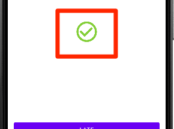
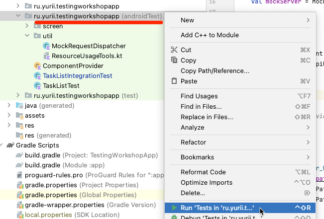
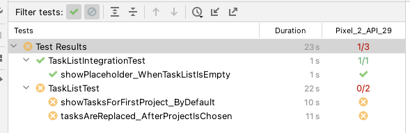

# Workshop 4

В рамках воркшопа вы напишите интеграционный UI тест.

## Добавить тест класс

Классы UI тестов не привязаны к определенному классу в коде. Обычно их создают также как и классы продуктового кода.

- Создать класс `TaskListIntegrationTest` в директории `androidTest`

  


- Унаследовать от класса `TestCase`

  Обратите внимание на package: `com.kaspersky.kaspresso.testcases.api.testcase.TestCase`
    ```kotlin
    class TaskListIntegrationTest : TestCase() {
    
    }
    ```

## Тест "для пустого списка отображается placeholder"

### Дополнить Screen (Page Object)

- Добавить элемент: "Плейс холдер"

  

    ```kotlin
    class TaskListScreen : KScreen<TaskListScreen>() {
        ...
        val taskList = ...
        val placeholder = KImageView { withId(R.id.placeholder) }
        ...
    }
    ```

### Перенаправить запросы на Mock сервер

- Добавить правило для запуска Mock сервера
    ```kotlin
    class TaskListIntegrationTest : TestCase() {    
        @get:Rule
        val mockServer = MockWebServer()
    }
    ```

- Перенаправить запросы на Mock сервер
    ```kotlin
    class TaskListIntegrationTest : TestCase() {    
        ...
        val mockServer = ...

        @Before
        fun setUp() {
            ComponentProvider.appComponent().apiUrlProvider().url = mockServer.url("/").toString()
        }
    }
    ```

### Добавить тест

- Добавить пустой метод в класс `TaskListIntegrationTest`

  Перенаправить вызов методу `run(...)` класса `BaseTestCase` из библиотеки Kaspresso.
    ```kotlin
    @Test
    fun showPlaceholder_WhenTaskListIsEmpty() = run {

    }
    ```

- Подготовить ответы для запросов
  
    - Зарегистрировать `dispatcher`
        ```kotlin
        @Test
        fun showPlaceholder_WhenTaskListIsEmpty() = run {
            mockServer.dispatcher = MockRequestDispatcher().apply {
            }
        }
        ```

    - При обращении к `/v2/projects` загрузить тело запроса из файла `projects_list.json` 
        ```kotlin
        @Test
        fun showPlaceholder_WhenTaskListIsEmpty() = run {
            mockServer.dispatcher = MockRequestDispatcher().apply {
                returnsForPath("/v2/projects") { setBody(loadFromAssets("projects_list.json")) }
            }
        }
        ```

    - При обращении к `/v2/tasks` в теле запроса вернуть строку `[]`
        ```kotlin
        @Test
        fun showPlaceholder_WhenTaskListIsEmpty() = run {
            mockServer.dispatcher = MockRequestDispatcher().apply {
                returnsForPath("/v2/projects") ...
                returnsForPath("/v2/tasks") { setBody("[]") }
            }
        }
        ```

- Добавить запуск `MainActivity`
    ```kotlin
    @Test
    fun showPlaceholder_WhenTaskListIsEmpty() = run {
        mockServer.dispatcher = MockRequestDispatcher().apply { ... }

        ActivityScenario.launch(MainActivity::class.java)
    }
    ```

- Проверить атрибуты плейс холдера 
    ```kotlin
    @Test
    fun showPlaceholder_WhenTaskListIsEmpty() = run {
        ...
        ActivityScenario.launch(...)
        val taskListScreen = TaskListScreen()

        step("Отображается плейс холдер") {
            taskListScreen.placeholder {
                isVisible()
                hasDrawable(R.drawable.ic_all_done)
            }
        }
    }
    ```

- Проверить отсутствие отображения списка задач 
    ```kotlin
    @Test
    fun showPlaceholder_WhenTaskListIsEmpty() = run {
        step("Отображается плейс холдер") {
            taskListScreen.placeholder { ... }
            taskListScreen.taskList.isNotDisplayed()
        }
    }
    ```

- Запустить тест

## Настроить оркестрацию

Запустить все тесты из контекстного меню директории **androidTest**. 



Часть тестов завершится с ошибкой. 



Воспользуемся оркестратором, чтобы изолировать тесты друг от друга. Необходимо внести изменения
в файл `build.gradle` модуля `:app`.

- Добавить дополнительные аргументы для раннера `testInstrumentationRunnerArguments`

    ```kotlin
    android {
        ...
        defaultConfig {
            ...
            testInstrumentationRunner "androidx.test.runner.AndroidJUnitRunner"
            testInstrumentationRunnerArguments clearPackageData: 'true'
        }
        ...
    }
    ```

- Добавить секцию `testOptions`

    ```kotlin
    android {
        ...
        defaultConfig { ... }

        testOptions {
            execution 'ANDROIDX_TEST_ORCHESTRATOR'
        }
    }
    ```

- Добавить зависимости в блок `dependencies`

    ```kotlin
    dependencies {
        ...
        androidTestImplementation 'androidx.test:runner:1.5.2'
        androidTestUtil 'androidx.test:orchestrator:1.4.2'
    }
    ```

- Выполнить синхронизацию проекта в Android Studio с файлами Gradle
- Повторно запустить все тесты 

# Summary

В результате у вас должно получиться что-то похожее на:

### Тест класс

```kotlin
package ru.yurii.testingworkshopapp

import androidx.test.core.app.ActivityScenario
import com.kaspersky.kaspresso.testcases.api.testcase.TestCase
import okhttp3.mockwebserver.MockWebServer
import org.junit.Before
import org.junit.Rule
import org.junit.Test
import ru.yurii.testingworkshopapp.screen.TaskListScreen
import ru.yurii.testingworkshopapp.util.MockRequestDispatcher

class TaskListIntegrationTest : TestCase() {

    @get:Rule
    val mockServer = MockWebServer()

    @Before
    fun setUp() {
        ComponentProvider.appComponent().apiUrlProvider().url = mockServer.url("/").toString()
    }

    @Test
    fun showPlaceholder_WhenTaskListIsEmpty() = run {
        mockServer.dispatcher = MockRequestDispatcher().apply {
            returnsForPath("/v2/projects") { setBody(loadFromAssets("projects_list.json")) }
            returnsForPath("/v2/tasks") { setBody("[]") }
        }

        ActivityScenario.launch(MainActivity::class.java)
        val taskListScreen = TaskListScreen()

        step("Отображается плейс холдер") {
            taskListScreen.placeholder {
                isVisible()
                hasDrawable(R.drawable.ic_all_done)
            }
            taskListScreen.taskList.isNotDisplayed()
        }
    }
}
```

### Page Object

```kotlin
package ru.yurii.testingworkshopapp.screen

import android.view.View
import com.kaspersky.kaspresso.screens.KScreen
import io.github.kakaocup.kakao.image.KImageView
import io.github.kakaocup.kakao.recycler.KRecyclerItem
import io.github.kakaocup.kakao.recycler.KRecyclerView
import io.github.kakaocup.kakao.text.KButton
import io.github.kakaocup.kakao.text.KTextView
import org.hamcrest.Matcher
import ru.yurii.testingworkshopapp.R
import ru.yurii.testingworkshopapp.tasklist.TaskListFragment

class TaskListScreen : KScreen<TaskListScreen>() {
    override val layoutId: Int = R.layout.task_list_fragment
    override val viewClass: Class<*> = TaskListFragment::class.java

    val projectButton = KButton { withId(R.id.currentProject) }
    val taskList = KRecyclerView({ withId(R.id.taskList) }, { itemType { TaskItem(it) } })
    val placeholder = KImageView { withId(R.id.placeholder) }

    class TaskItem(parent: Matcher<View>) : KRecyclerItem<TaskItem>(parent) {
        val title = KTextView(parent) { withId(R.id.title) }
        val bullet = KImageView(parent) { withId(R.id.bullet) }
    }
}
```

### build.gradle

```kotlin
plugins {
    id 'com.android.application'
    id 'org.jetbrains.kotlin.android'
    id 'org.jetbrains.kotlin.plugin.serialization'
    id 'kotlin-parcelize'
}

android {
    compileSdk 33

    defaultConfig {
        applicationId "ru.yurii.testingworkshopapp"
        minSdk 24
        targetSdk 33
        versionCode 1
        versionName "1.0"

        testInstrumentationRunner "androidx.test.runner.AndroidJUnitRunner"
        testInstrumentationRunnerArguments clearPackageData: 'true'
    }

    testOptions {
        execution 'ANDROIDX_TEST_ORCHESTRATOR'
    }

    buildTypes {
        release {
            minifyEnabled false
            proguardFiles getDefaultProguardFile('proguard-android-optimize.txt'), 'proguard-rules.pro'
        }
    }
    compileOptions {
        sourceCompatibility JavaVersion.VERSION_1_8
        targetCompatibility JavaVersion.VERSION_1_8
    }
    kotlinOptions {
        jvmTarget = '1.8'
    }

    buildFeatures {
        viewBinding true
    }
}

ext {
    coroutines_version = "1.6.4"
    lifecycle_version = "2.6.1"
    retrofit_version = "2.9.0"
    okhhtp_version = "4.10.0"
}

dependencies {

    implementation 'androidx.core:core-ktx:1.10.0'
    implementation 'androidx.fragment:fragment-ktx:1.5.7'
    implementation 'androidx.appcompat:appcompat:1.6.1'
    implementation 'com.google.android.material:material:1.8.0'
    implementation 'androidx.constraintlayout:constraintlayout:2.1.4'
    implementation 'androidx.recyclerview:recyclerview:1.3.0'

    implementation "androidx.lifecycle:lifecycle-viewmodel-ktx:$lifecycle_version"
    implementation "androidx.lifecycle:lifecycle-livedata-ktx:$lifecycle_version"

    implementation "com.squareup.retrofit2:retrofit:$retrofit_version"
    implementation "org.jetbrains.kotlinx:kotlinx-serialization-json:1.5.0"
    implementation 'com.jakewharton.retrofit:retrofit2-kotlinx-serialization-converter:1.0.0'

    implementation "com.squareup.okhttp3:okhttp:$okhhtp_version"
    implementation "com.squareup.okhttp3:logging-interceptor:$okhhtp_version"

    implementation "org.jetbrains.kotlinx:kotlinx-coroutines-core:$coroutines_version"

    testImplementation "junit:junit:4.13.2"
    testImplementation "androidx.arch.core:core-testing:2.2.0"
    testImplementation "org.jetbrains.kotlinx:kotlinx-coroutines-test:$coroutines_version"

    androidTestImplementation "androidx.test.ext:junit:1.1.5"
    androidTestImplementation "com.kaspersky.android-components:kaspresso:1.5.1"
    androidTestImplementation "com.squareup.okhttp3:mockwebserver:$okhhtp_version"
    androidTestImplementation 'androidx.test:runner:1.5.2'
    androidTestUtil 'androidx.test:orchestrator:1.4.2'
}
```
