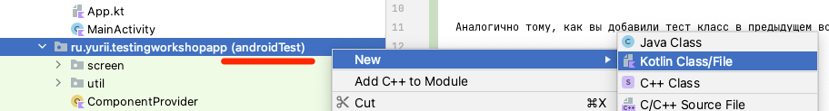

# Workshop 4

В рамках воркшопа вы напишите интеграционный UI тест.

## Добавить тест класс

Классы UI тестов не привязаны к определенному классу в коде. Обычно их создают также как и классы продуктового кода.

- Создать класс `TaskListIntegrationTest` в директории `androidTest`

  


- Унаследовать от класса `TestCase`

  Обратите внимание на package: `com.kaspersky.kaspresso.testcases.api.testcase.TestCase`
    ```kotlin
    class TaskListIntegrationTest : TestCase() {
    
    }
    ```

## Тест "для пустого списка отображается placeholder"

### Перенаправить запросы на Mock сервер

- Добавить правило для запуска Mock сервера
    ```kotlin
    class TaskListIntegrationTest : TestCase() {    
        @get:Rule
        val mockServer = MockWebServer()
    }
    ```

- Перенаправить запросы на Mock сервер
    ```kotlin
    class TaskListIntegrationTest : TestCase() {    
        ...
        val mockServer = ...

        @Before
        fun setUp() {
            ComponentProvider.appComponent().apiUrlProvider().url = mockServer.url("/").toString()
        }
    }
    ```

### Добавить тест

- Добавить пустой метод в класс `TaskListIntegrationTest`

  Перенаправить вызов методу `run(...)` класса `BaseTestCase` из библиотеки Kaspresso.
    ```kotlin
    @Test
    fun showPlaceholder_WhenTaskListIsEmpty() = run {

    }
    ```

- Подготовить ответы для запросов
  
    - Зарегистрировать `dispatcher`
        ```kotlin
        @Test
        fun showPlaceholder_WhenTaskListIsEmpty() = run {
            mockServer.dispatcher = MockRequestDispatcher().apply {
            }
        }
        ```

    - При обращении к `/v1/projects` загрузить тело запроса из файла `projects_list.json` 
        ```kotlin
        @Test
        fun showPlaceholder_WhenTaskListIsEmpty() = run {
            mockServer.dispatcher = MockRequestDispatcher().apply {
                returnsForPath("/v1/projects") { setBody(loadFromAssets("projects_list.json")) }
            }
        }
        ```

    - При обращении к `/v1/tasks` в теле запроса вернуть строку `[]`
        ```kotlin
        @Test
        fun showPlaceholder_WhenTaskListIsEmpty() = run {
            mockServer.dispatcher = MockRequestDispatcher().apply {
                returnsForPath("/v1/projects") ...
                returnsForPath("/v1/tasks") { setBody("[]") }
            }
        }
        ```

- Добавить запуск `MainActivity`
    ```kotlin
    @Test
    fun showPlaceholder_WhenTaskListIsEmpty() = run {
        mockServer.dispatcher = MockRequestDispatcher().apply { ... }

        ActivityScenario.launch(MainActivity::class.java)
    }
    ```

- Проверить атрибуты плейс холдера 
    ```kotlin
    @Test
    fun showPlaceholder_WhenTaskListIsEmpty() = run {
        ...
        ActivityScenario.launch(...)

        step("Отображается плейс холдер") {
            TaskListScreen.placeholder {
                isVisible()
                hasDrawable(R.drawable.ic_all_done)
            }
        }
    }
    ```

- Проверить атрибуты списка задач 
    ```kotlin
    @Test
    fun showPlaceholder_WhenTaskListIsEmpty() = run {
        step("Отображается плейс холдер") {
            TaskListScreen.placeholder { ... }
            TaskListScreen.taskList.isNotDisplayed()
        }
    }
    ```

- Запустить тест

# Summary

В результате у вас должно получиться что-то похожее на:

### Тест класс

```kotlin
package ru.yurii.testingworkshopapp

import androidx.test.core.app.ActivityScenario
import com.kaspersky.kaspresso.testcases.api.testcase.TestCase
import okhttp3.mockwebserver.MockWebServer
import org.junit.Before
import org.junit.Rule
import org.junit.Test
import ru.yurii.testingworkshopapp.screen.TaskListScreen
import ru.yurii.testingworkshopapp.util.MockRequestDispatcher

class TaskListIntegrationTest : TestCase() {

    @get:Rule
    val mockServer = MockWebServer()

    @Before
    fun setUp() {
        ComponentProvider.appComponent().apiUrlProvider().url = mockServer.url("/").toString()
    }

    @Test
    fun showPlaceholder_WhenTaskListIsEmpty() = run {
        mockServer.dispatcher = MockRequestDispatcher().apply {
            returnsForPath("/v1/projects") { setBody(loadFromAssets("projects_list.json")) }
            returnsForPath("/v1/tasks") { setBody("[]") }
        }

        ActivityScenario.launch(MainActivity::class.java)

        step("Отображается плейс холдер") {
            TaskListScreen.placeholder {
                isVisible()
                hasDrawable(R.drawable.ic_all_done)
            }
            TaskListScreen.taskList.isNotDisplayed()
        }
    }

}
```

### Page Object

```kotlin
package ru.yurii.testingworkshopapp.screen

import android.view.View
import com.kaspersky.kaspresso.screens.KScreen
import io.github.kakaocup.kakao.image.KImageView
import io.github.kakaocup.kakao.recycler.KRecyclerItem
import io.github.kakaocup.kakao.recycler.KRecyclerView
import io.github.kakaocup.kakao.text.KButton
import io.github.kakaocup.kakao.text.KTextView
import org.hamcrest.Matcher
import ru.yurii.testingworkshopapp.R
import ru.yurii.testingworkshopapp.tasklist.TaskListFragment

object TaskListScreen : KScreen<TaskListScreen>() {
    override val layoutId: Int = R.layout.task_list_fragment
    override val viewClass: Class<*> = TaskListFragment::class.java

    val projectButton = KButton { withId(R.id.currentProject) }
    val taskList = KRecyclerView({ withId(R.id.taskList) }, { itemType { TaskItem(it) } })
    val placeholder = KImageView { withId(R.id.placeholder) }

    class TaskItem(parent: Matcher<View>) : KRecyclerItem<TaskItem>(parent) {
        val title = KTextView(parent) { withId(R.id.title) }
        val bullet = KImageView(parent) { withId(R.id.bullet) }
    }
}
```
